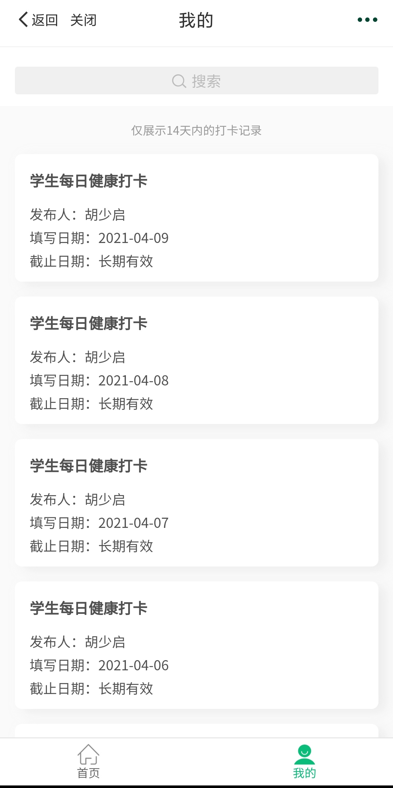
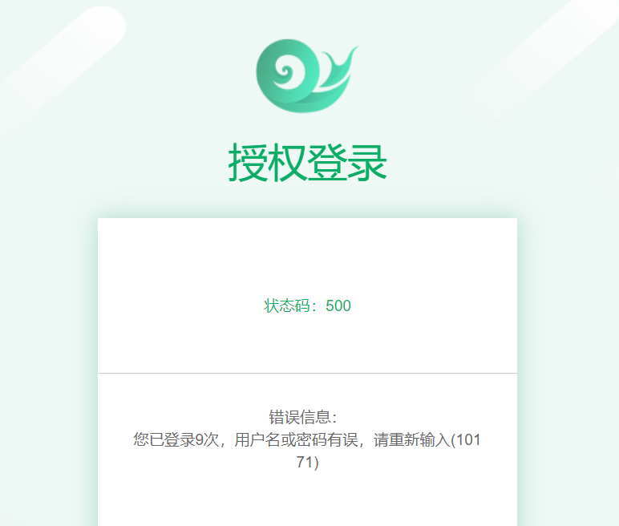

# 这里是自动打卡项目的部署教程

1. 首先打开自动打卡项目的主界面->[自动打卡](https://github.com/xsk666/autopost)  
   
   在右上角可以找到Star和Fork（如图）  
   (如果你***很喜欢***此项目，给一个***Star***吧(球球了))

---

2. 点击***Fork***，然后等待网页跳转完成

---

3. 修改main文件夹里的[`users.json`](../main/users.json)
     
   先将原来的信息删除，然后按照下面的格式修改此文件

   ```
   [
      {
         "name": "姓名",
         "stucode": "学号",
         "password": "密码（可以和学号一样）",
         "enable": "true"
      },
      {
         "name": "姓名2",
         "stucode": "学号",
         "password": "密码（可以和学号一样）",
         "enable": "true"
      }
   ]
   ```

   注意事项
	
	* 每个人信息分开填写，用`{}`包住，一个`{}`完成后在其后加入`,`
	* 最后一个人的信息之后的`}`不需要带`,`

---

4. 注册qmsg酱  
   网站传送->https://qmsg.zendee.cn/me.html#/login  
   登陆后选择一个qmsg机器人，并添加其为QQ好友  
   在KEY选项卡得到并复制key
   

---

5. 修改index.py  
   打开[`index.py`](../main/index.py)   
   可以在函数名为qq(第16行)内看到qmsg变量  
   将其修改为你的key即可

---

6. 修改test.yml  
   打开[test.yml](../.github/workflows/test.yml)
   删除30行之后的内容
   

---

7. 删除一些东西
   
	* 删除[test](../test)文件夹
	* 删除[test2.yml](../.github/workflows/test2.yml)
	* 删除[helper.py](../main/helper.py)

---

8. 开启Actions  
   点击绿色的按钮
     
   按下图顺序开启workflow即可
     
   按下图顺序进行一次手动触发打卡  
   然后刷新一下，稍等actions运行  
   
	* 下图为正在进行的样子
	  
	* 下图为成功的样子  
	  
	* 下图为错误的样子  
	  
	* 点进actions即可查看具体日志
	  

---

9. 关于定时  
   打开[test.yml](../.github/workflows/test.yml)  
   可以看到第六行如下
   ```
   - cron: '59 15 * * *'
   ```
   建议不要调整该时间，此时间已是很合理的时间   
   (因为github免费用户的actions是需要排队的)  
   经过长时间测试，此定时器具体运行时间为凌晨00:30左右

   自定义定时方法如下  
   

---

10. 关于外校
	1. 首先确定你的学校打卡部分是不是与以下图片***相似***
	     
	     
	   
	
	* 如果***相似***，那么恭喜你可以正常使用此项目  
	  你的学校与我的学校（滁州学院）使用的是同一种打卡
	* 如果***不相似***，那么此项目不太适合你哦
	
	2. 打开此网页尝试使用学号和密码登录  
	   登录网页->https://yq.weishao.com.cn/check/questionnaire
		* 登录失败图例
		  
		  如果出现与此图相似内容，那么此项目***不适合***你的学校哦
		* 如果正常登录，即可看到与APP里面一样的打卡界面
	
	3. 在确定成功登录后，修改`index.py`和`users.json`  
	   因为开发者为滁州学院学生，所以此项目默认登录到滁州学院的打卡平台  
	   外校同学请在修改[`index.py`](../main/index.py)第45行的domain编码  
	   domain编码在此处查看->(https://api.weishao.com.cn/login/api/school)
		* 示例 可以在上述网页的内容中找到你的学校，格式如下
		   ```
		   {"name":"滁州学院","domain":"chzu","pinyin":"chuzhouxueyuan"}
		   ```
		  domain之后的`chzu`即为滁州学院的domain编码

       找到[`index.py`](../main/index.py)第45行，修改即可
	   ```
	   # 如果用户(users.json)填写含有schoolcode则设为对应学校
	   # 否则设为滁州学院（外校同学设置为自己学校domain编码）
	   if "schoolcode" not in info[i]:
		   info[i]['schoolcode'] = 'chzu'
	   ```
	   如果你还有外校同学也使用相同的打卡系统  
	   那么在`users.json`的该同学信息之后加上`schoolcode`键即可
		* 示例
	   ```
	   {
		    "name": "姓名",
		    "stucode": "学号",
		    "password": "密码",
		    "schoolcode": "chzu",
		    "enable": "true"
	   }
		```

---

### 写在最后

此部署教程已经非常详细了   
跟着此教程来的话，不会有任何问题  
如果还有问题的话，麻烦百度搜索[`github基本操作`](https://www.baidu.com/s?ie=UTF-8&wd=github%E6%96%87%E4%BB%B6%E5%9F%BA%E6%9C%AC%E6%93%8D%E4%BD%9C)  
最后再求求star，感恩