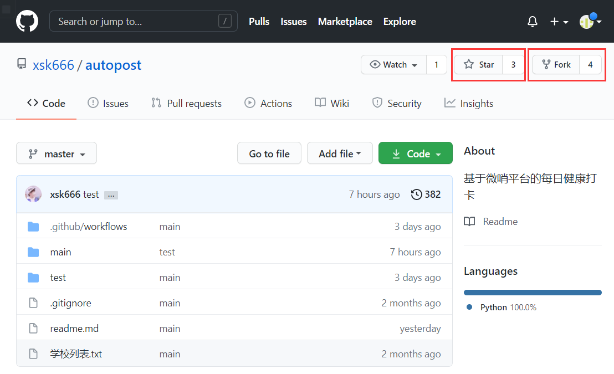
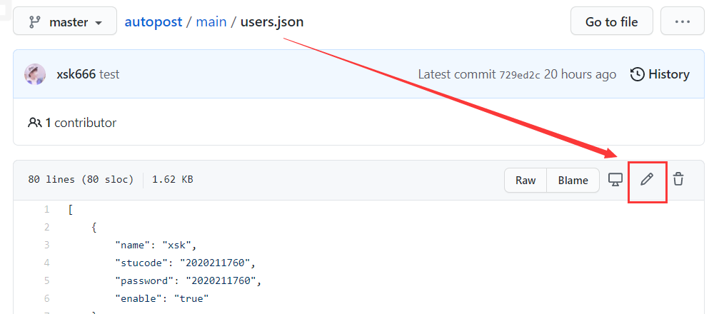
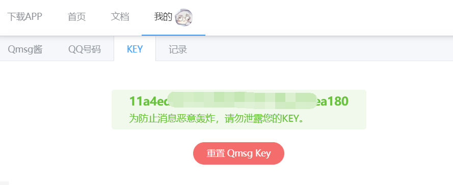
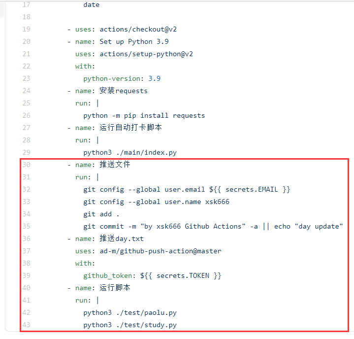
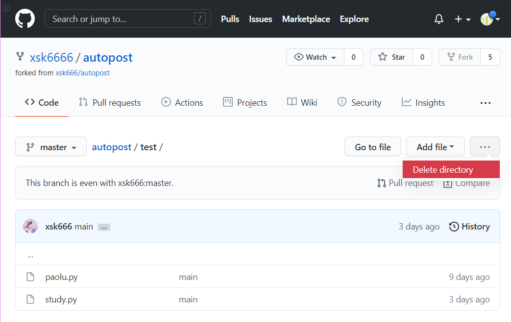
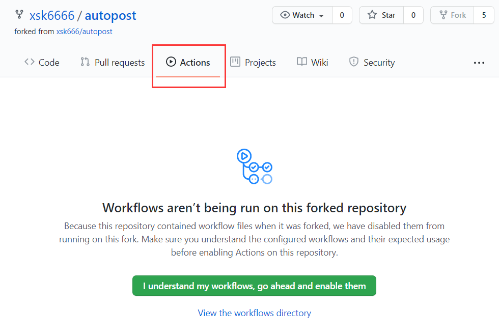
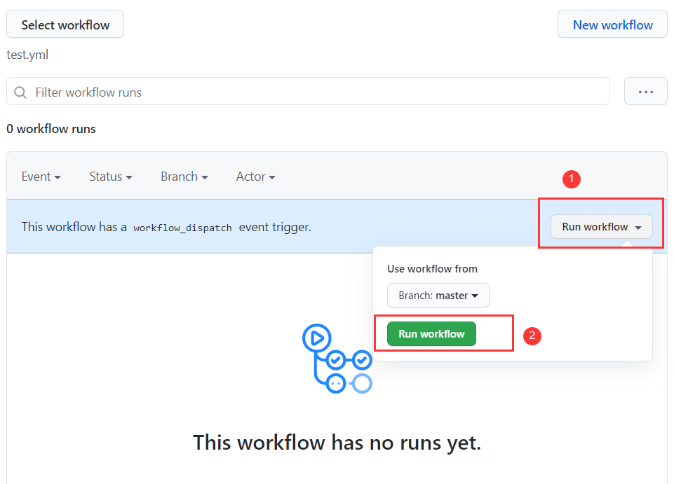
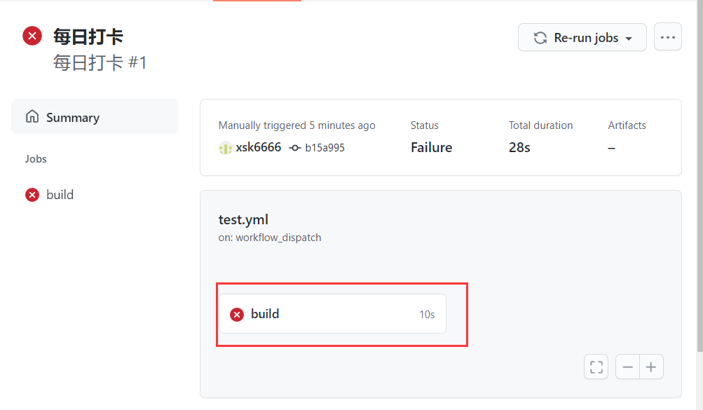

# 这里是自动打卡项目的部署教程

1. 首先打开自动打卡项目的主界面->[自动打卡](https://github.com/xsk666/autopost)  
   
   在右上角可以找到Star和Fork（如图）  
   (如果你 很喜欢/感激 此项目，可以给一个Star(感恩))

2. 点击Fork，然后等待网页跳转完成
3. 修改main文件夹里的[`users.json`](/main/users.json)
     
   先将原来的信息删除，然后按照下面的格式重新填写此文件

```
[
    {
        "name": "姓名",
        "stucode": "学号",
        "password": "密码（可以和学号一样）",
        "enable": "true"
    },
    {
        "name": "姓名2",
        "stucode": "学号",
        "password": "密码（可以和学号一样）",
        "enable": "true"
    }
]
```

注意事项

* 每个人信息分开填写，用`{}`包住，一个`{}`完成后在其后加入`,`
* 最后一个人的信息之后的`}`不需要带`,`

4. 注册qmsg酱  
   网站传送->https://qmsg.zendee.cn/me.html#/login  
   登陆后选择一个qmsg机器人，并添加其为QQ好友  
   在KEY选项卡得到并复制key
   

5. 修改index.py 打开[`index.py`](/main/index.py)   
   可以在函数名为qq(第16行)内看到qmsg变量  
   将其修改为你的key即可

6. 修改test.yml  
   打开[test.yml](/.github/workflows/test.yml)
   删除30行之后的内容
   


7. 删除一些东西
   

* 删除[test](/test)文件夹
* 删除[test2.yml](/.github/workflows/test2.yml)
* 删除[helper.py](/main/helper.py)

8. 开启Actions  
   点击绿色的按钮
     
   按下图顺序开启workflow即可
     
   按下图顺序进行一次手动触发打卡，然后刷新一下
   
    * 下图为正在进行的样子
      
    * 下图为成功的样子  
      
    * 下图为错误的样子  
      
    * 点进actions即可查看具体日志
      